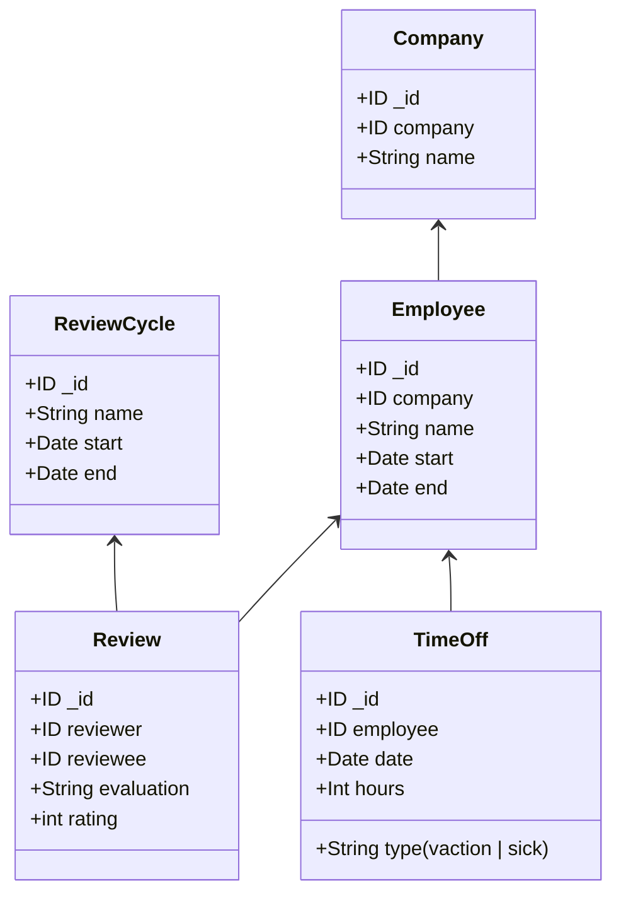

# Work

Office management software

# Entity Relationship Diagram

```mermaid
classDiagram
    class Company
      Company : +ID _id
      Company : +ID company
      Company : +String name

    class Employee
      Employee : +ID _id
      Employee : +ID company
      Employee : +String name
      Employee : +Date start
      Employee : +Date end

    class TimeOff
      TimeOff : +ID _id
      TimeOff : +ID employee
      TimeOff : +Date date
      TimeOff : +Int hours
      TimeOff : +String type (vaction | sick)

    class Review
      Review : +ID _id
      Review : +ID reviewer
      Review : +ID reviewee
      Review : +String evaluation
      Review : +int rating
    
    class ReviewCycle
      ReviewCycle : +ID _id
      ReviewCycle : +String name
      ReviewCycle : +Date start
      ReviewCycle : +Date end

    Company <-- Employee
    ReviewCycle <-- Review
    Employee <-- Review
    Employee <-- TimeOff
```
